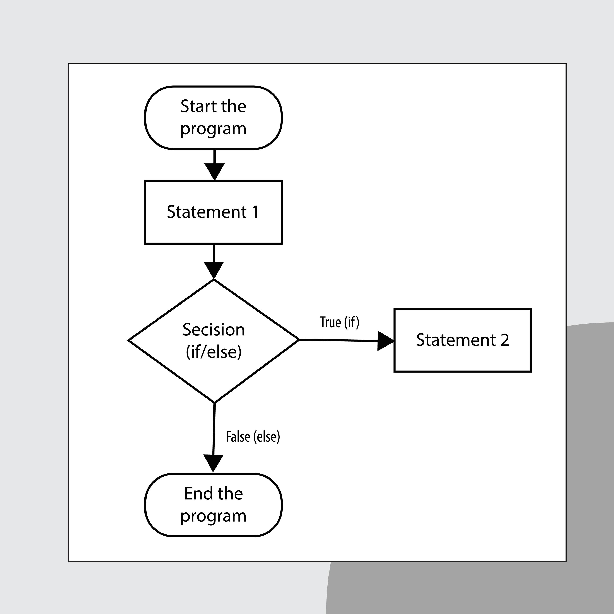

# The for statement
ในการวนซ้ำ เราสามารถใช้คำสั่ง `for` ในการทำได้ ซึ่งมีความแตกต่างจาก `while` ตรงที่ `for` จะใช้กับการวนซ้ำที่รู้จำนวนรอบในการวนแน่นอน ต่อไปนี้คือตัวอย่างการใช้ `for` ในการคำนวนอุณหภูมิ

    #include <stdio.h>

    int main()
    {
        int fahr;

        for (fahr = 0; fahr <= 300; fahr = fahr + 20)
        {
            printf("%3d %6.1f\n", fahr, (5.0/9.0)*(fahr-32));
        }

        return 0;
    }

## ส่วนประกอบของ `for`
ในวงเล็บจะประกอบด้วย 3 ส่วนหลัก โดยขึ้นด้วยเครื่องหมาย semicolon (`;`) 
1. **initialization (fahr = 0)** ทำครั้งแรกครั้งเดียวในการลูป เพื่อกำหนดค่าเริ่มต้นให้กับตัวแปร
2. **Condition (fahr <= 300)** เงื่อนไขที่จะตรวจสอบก่อนลูปรอบถัดไป ถ้าเป็นจริงจะทำคำสั่งในลูป ถ้าเป็นเท็จจะออกจากลูป
3. **Increment/Step (fahr = fahr + 20)** วนที่ใช้เพิ่มหรือลดค่าตัวแปร จะทำงานหลังจากทำคำสั่งในลูปเสร็จสิ้นในแต่ละรอบ

    

## ความแตกต่างระหว่าง `while` กับ `for`
- **ความกระชับ** for รวบรวมการจัดการตัวแปรควบคุมลูป (กำหนดค่า, เช็คเงื่อนไข, เปลี่ยนค่า) ไว้ในที่เดียว ทำให้โค้ดอ่านง่ายและป้องกันการลืมเปลี่ยนค่าตัวแปร (ซึ่งอาจทำให้เกิด Infinite Loop ใน while)
- **การเลือกใช้** K&R แนะนำว่า for เหมาะสำหรับลูปที่มีการกำหนดค่าเริ่มต้นและมีการเปลี่ยนแปลงค่าแบบเป็นลำดับที่แน่นอน (เช่น เพิ่มค่าทีละเท่าๆ กัน)

## Symolic Constants
ในโค้ดตัวอย่าง ตัวเลข 300 และ 20 ที่ใส่ลงไปในโค้ดโดยตรงนั้นเรียกว่า **Magic Numbers** ซึ่งเป็นนิสัยเขียนโปรแกรมที่ไม่ดี เพราะแก้ไขยาก และสื่อความหมายได้ไม่ชัดเจน